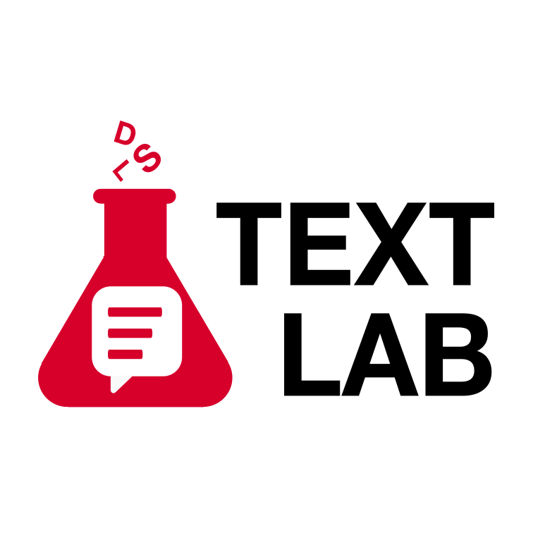

# Text Lab

  

**Text Lab** is a secure, interactive suite of advanced Artificial Intelligence and Natural Language Processing (NLP) tools designed to run directly on the University of Bern's High-Performance Computing cluster (UBELIX).

---

## Documentation & User Guide

For comprehensive instructions, tutorials, capabilities, and best practices, please visit the official User Guide:
 **[https://text-lab.dsl.unibe.ch/](https://text-lab.dsl.unibe.ch/)**

---

##  Features 

The application features a modular, secure architecture offering the following tools:

- ** Audio Transcription:** Highly accurate multi-lingual transcription using Whisper. Includes **Speaker Diarization**, VAD pre-filtering, and dedicated support for Swiss German.
- ** AI Chat:** A private AI assistant (powered by Ollama) that allows you to upload and interact directly with your own documents (PDFs, text, datasets).
- ** Advanced OCR:** Extract text, complex tables, and layouts from images and PDFs using a choice of state-of-the-art vision models (GLM-OCR, olmOCR, PaddleOCR, EasyOCR).
- ** AI Data Visualiser:** Upload your tabular data and instruct an AI agent (via an internal MCP server) to automatically write Python code and generate interactive plots.
- ** Knowledge Graph Generator:** Process collections of scientific papers using Grobid to automatically extract metadata, citations, and research topics via LLMs, visualizing them as an interactive network graph.
- ** Topic Modeling:** Extract topics from raw text data using SOTA models.
---

##  Privacy & Security

Because all models run on university hardware via the Open OnDemand platform, your sensitive research data **never leaves the university network**. The application utilizes zero-footprint, ephemeral session states to ensure maximum security on shared infrastructure.

---

##  Launching the App

The app is accessible via [UBELIX Open OnDemand](https://ondemand.hpc.unibe.ch/) and is available **only within the Unibe internal network (or via VPN)**.

When launching the app from the *Data Science Lab Services* menu, you can specify several parameters to tailor its execution:

- **Job Time (hours):** Specify the maximum duration for the app to be active. It will automatically terminate after this time to ensure fair resource allocation.
- **GPU Type:** Request a specific GPU (e.g., RTX 4090, A100).
- **SLURM Partition:** Select the `gpu` partition.
- **Quality of Service (QoS):** Use `job_gpu_preemptable` for quick tasks. Note that preemptable resources can be reclaimed by the system if needed. Use `job_gpu` if you have a specific allocation.
- **Number of GPUs:** Typically `1` is sufficient, but more can be requested if running very large LLMs in the Chat tool.

For more detailed guidelines on job submission, please refer to the [HPC Documentation](https://hpc-unibe-ch.github.io/).

---

##  Repository Structure (NOT UP TO DATE INFO)

- `src/pages/`: Streamlit UI frontend interface files.
- `src/core/`: Backend business logic, LLM interaction, MCP server, and data processing engines.
- `src/assets/`: Application icons and logos.
- `docs/`: MkDocs documentation site source code.
- `template/` & `form.yml`: Open OnDemand deployment configurations.

---

##  Support & Further Information

Maintained by the Data Science Lab (DSL) at the University of Bern.  
For support with the app, bug reports, or related NLP services, please contact: **[support.dsl@unibe.ch](mailto:support.dsl@unibe.ch)**

If you'd like to be informed about updates and changes to Text Lab, please subscribe to the following mailing list: https://listserv.unibe.ch/mailman/listinfo/text-lab-announcement.dsl